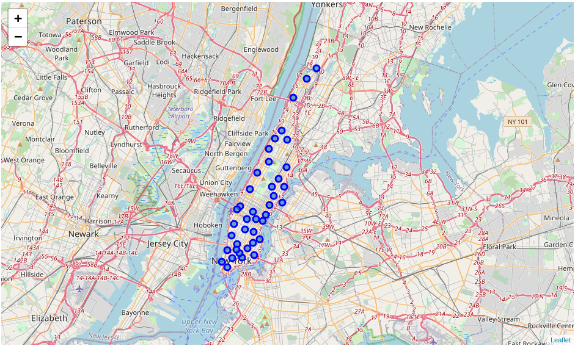
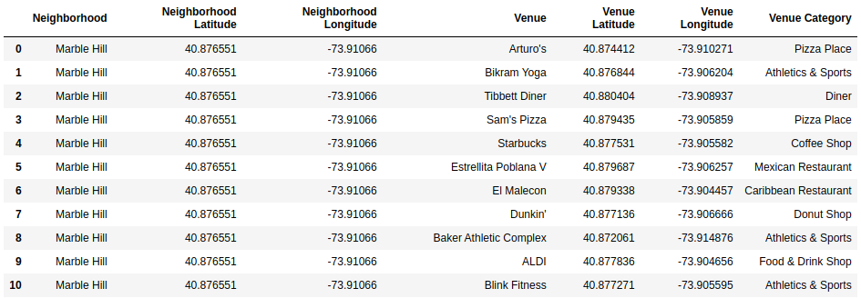
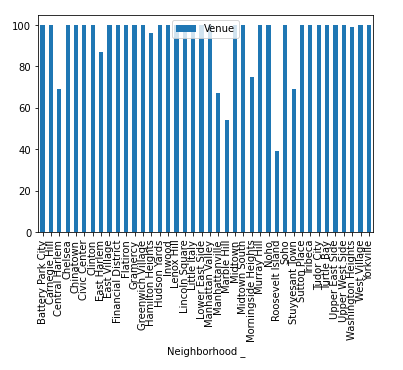
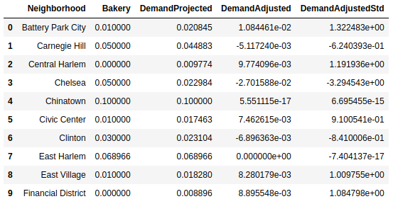
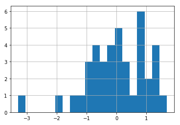
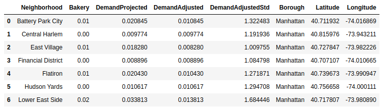
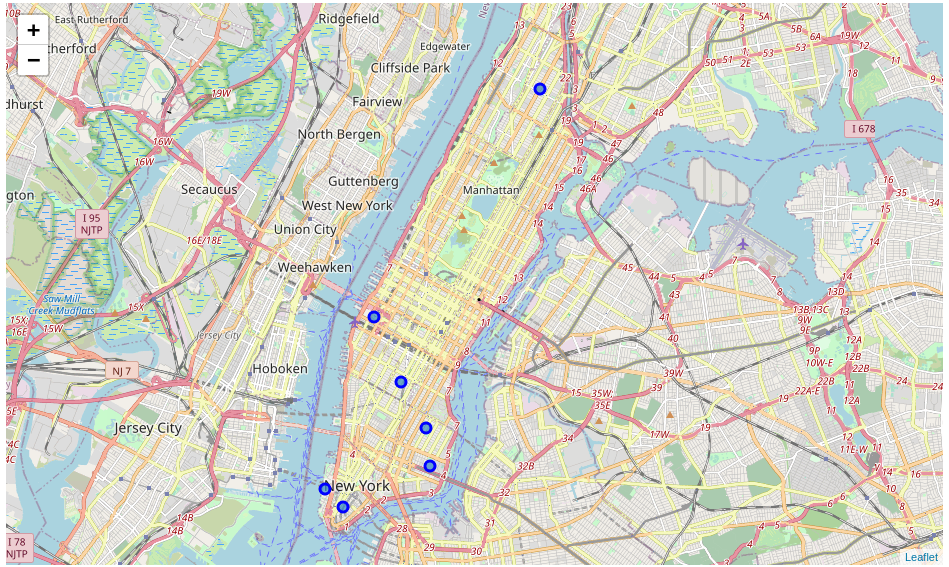

## Background

New York is a big city and gives a lot of opportunities for different kinds of businesses, but learning of the existing market is one of key inputs to plan a successful one. Here I will be building the solution which will help a potential investor or business owner to make the judgment about finding a good spot stop for opening a new place in the city.
More specifically here we will analyze already existing places in New York City and will make a suggestion on the placement of a new Bakery in Manhattan.  
Once having suggested areas, they will be presented on the map for better comprehension.

## Data Description

Following data points are used in this case:
1) The list of New York neighborhoods with respective geographical coordinates;
2) Foursquare’s venues listings with information about places’ coordinates and categories. This will allow to identify the relation of places to neighborhoods and analyze the profile of each neighborhood in terms of what places are typically located there.
3) Foursquare’s categories dictionary which defines the tree-structure of all available place categories on Foursquare. This will allow to apply some grouping over places list to have comparable categories over different neighborhoods. 
4) Geopy to find the NY geographical location for map drawing.

## Methodology

In this study I've mainly used Foursquare API which exposes data as a REST endpoint as well as Geopy and the list of NY neighborhoods which are available as Python package and a CSV file respectively.

The Folium python packae was used to visualize data on the map, it helped with both with data exploration and presentation of results of research:

Having the list of neighbours we will collect the information about venues aound them and their categories which will allow us to learn the profile about each noighbourhood and them make the recommendation. Having the coordinates of each neighborhood from original CSV dataset I'm making calls to Foursquare API with radius of 300m which shows both good separation between neighbourhoods in this case.

In result we're getting the dataframe with list of venues, their categories, and relation to neighborhoods.

Also we can see how many places were found for each neighbourhood (I used the limit of 100 venues per neighborhood):

As a data cleaning here I also decided to bucket categories into more generic groups so that categories like 'Acehnese Restaurant' or 'Balinese Restaurant' will now fall into a single bucket of 'Indonesian Restaurant'. So that it rediced the number of unique categories from __ to __ across total __ number of venues.

Now we need to identify the profile of each neighborhood. For this we're making the one-hot encoding for venue categories and perform mean aggregation within neighbourhood which gives us the scaled frequency of how often each category of venues are present in each of them.

Having this in place we can now build the multi-regression model which will project the popularity of bakeries based on other types of venues in the neighbourhood.

Following steps are:
- Fitting the model;
- Collecting the estimated popularity of bakeries based on other venues near by;
- Substracting the actual popularity from the estimated value so that we will see the unfulfilled demand gap;
- And standardize the gap so that we can judge the actual level of demand.

This yields us the following data set:

With the following distribution for 'DemandAdjustedStd':

## Results

Now as we have the standardized demand we can set a threshold and see what neighbourhoods has the highest not fulfilled demand on bakeries. I will use 'DemandAdjustedStd' > 1 criteria here.

And we can visualize this on the map:

So these are suggested locations to open a new bakery in Manhattan, NY.

## Discussion

While I was using the proximity of the venue to the geographical center of the neighbourhood to partition the area there are a couple of other options to consider. One is to use ZIP codes which also provides comparable zones for analysis the other is to use the 'honeycomb' split which devides the area on uniform hexagons which is also used by Uber.

The other possible way to continue the idea is to build the Web or Mobile application which would prompt user to specify the city and venue category of interest and perform same calculations with provided inputs allowing users to learn the market in a quick way.

## Conclusion

While opening a new business a lot of factors have to be considered and appropriate market research allows to achieve good starting points. In this case we saw that even on a pretty populated market there are better and worse opportunities and anlysis was able to identify the ones that must face a bigger demand based on available input information. Such insigths are highly valuable for investors and business owners.

